# Project Overview: Real-Time Web Application in AWS VPC

We will create a web application that can receive requests over the internet and respond in real-time. This will include:

1. **Creating a VPC**
2. **Creating subnets**
3. **Setting up an Internet Gateway**
4. **Configuring route tables**
5. **Setting up Network ACLs**
6. **Launching an EC2 instance to serve the web application**

Step-by-Step Guide

Step 1: Create a VPC

1. **Log in to the AWS Management Console** and navigate to the **VPC** dashboard.

2. **Create a New VPC:**
   - Click on "Create VPC."
   - Enter a name for your VPC (e.g., `MyVPC`).
   - Use an appropriate CIDR block (e.g., `10.0.0.0/16`).
   - Click "Create."
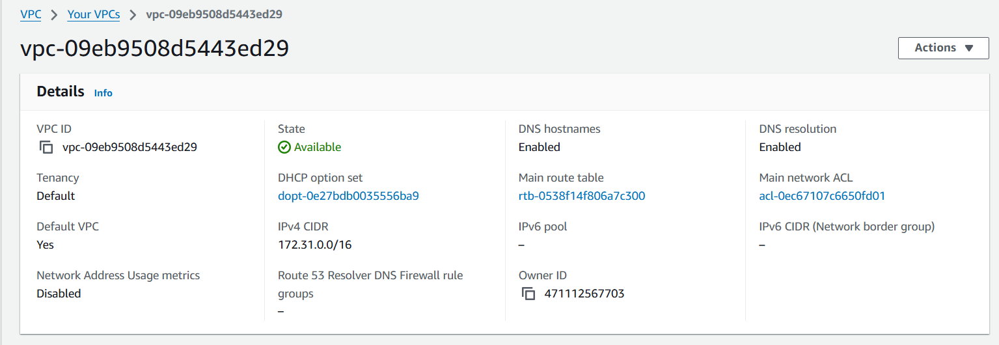
Step 2: Create Subnets

1. **Create Public Subnet:**
   - Go to the **Subnets** section.
   - Click on "Create subnet."
   - Choose your VPC from the dropdown.
   - Name the subnet (e.g., `PublicSubnet`).
   - Specify a CIDR block (e.g., `10.0.1.0/24`).
   - Choose an Availability Zone.
   - Click "Create."
   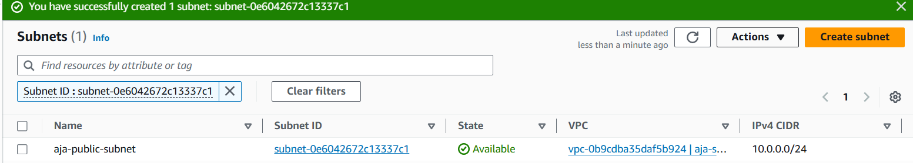

2. **Create Private Subnet:**
   - Repeat the above steps to create a private subnet (e.g., `PrivateSubnet` with CIDR `10.0.2.0/24`).
   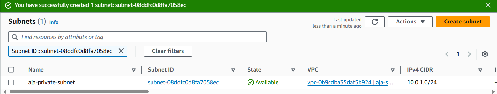

Step 3: Set Up an Internet Gateway

1. **Create an Internet Gateway:**
   - Go to the **Internet Gateways** section.
   - Click "Create Internet Gateway."
   - Name it (e.g., `MyIGW`).
   - Click "Create."
   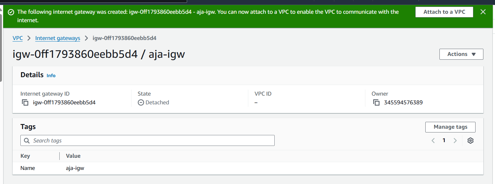

2. **Attach the Internet Gateway to Your VPC:**
   - Select the Internet Gateway and click on "Actions" > "Attach to VPC."
   - Choose your VPC and click "Attach."
   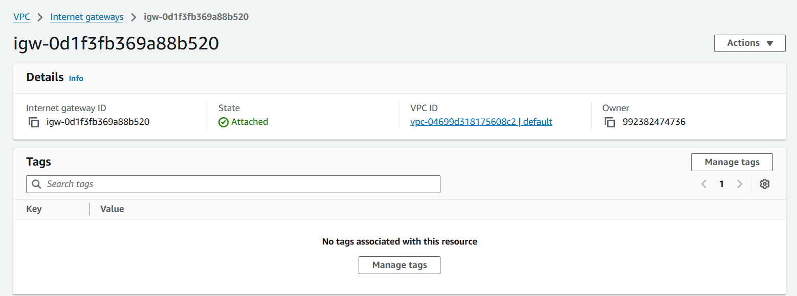

Step 4: Configure Route Tables

1. **Create a Route Table for the Public Subnet:**
   - Go to the **Route Tables** section.
   - Click on "Create route table."
   - Name it (e.g., `PublicRT`).
   - Choose your VPC and click "Create."
   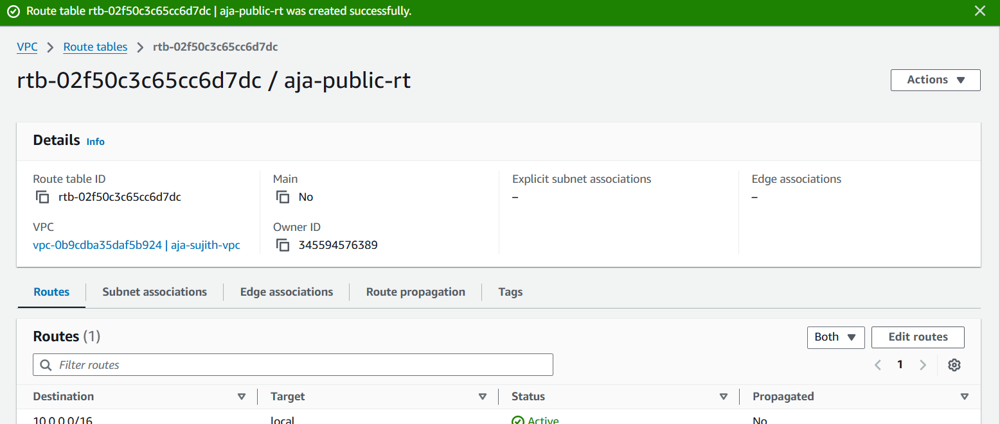

2. **Add Route to the Route Table:**
   - Select your public route table.
   - Click on the "Routes" tab and then "Edit routes."
   - Click "Add route," set the destination as `0.0.0.0/0`, and target as your Internet Gateway.
   - Click "Save routes."
   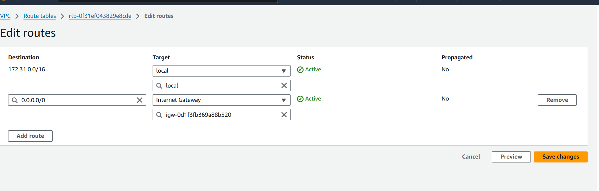

3. **Associate the Route Table with the Public Subnet:**
   - Go to the "Subnet Associations" tab.
   - Click "Edit subnet associations."
   - Select your public subnet and click "Save."
   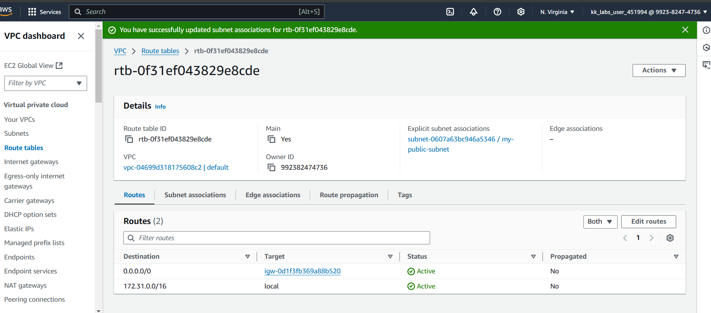

4. **Private Route Table (optional):**
   - The private subnet will not have a direct route to the internet. Ensure it has the default route that points to the local VPC.

Step 5: Set Up Network ACLs

1. **Create a Network ACL:**
   - Go to the **Network ACLs** section.
   - Click "Create network ACL."
   - Name it (e.g., `MyNACL`) and choose your VPC.
   - Click "Create."
   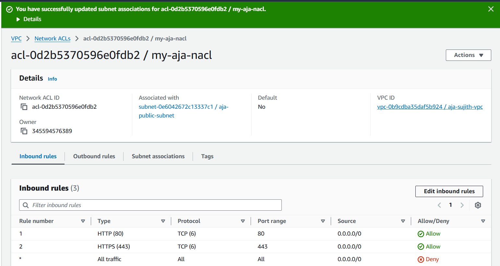

2. **Configure Inbound Rules:**
   - Select the NACL and go to the "Inbound rules" tab.
   - Click "Edit inbound rules."
   - Add rules to allow HTTP (port 80) and HTTPS (port 443) traffic.
     - Rule #100: Type: HTTP, Protocol: TCP, Port range: 80, Source: 0.0.0.0/0 (Allow all)
     - Rule #110: Type: HTTPS, Protocol: TCP, Port range: 443, Source: 0.0.0.0/0 (Allow all)
     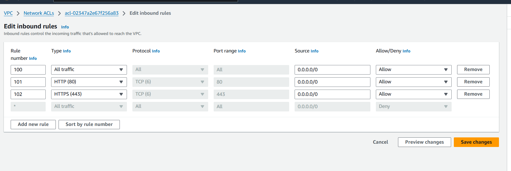

3. **Configure Outbound Rules:**
   - Go to the "Outbound rules" tab and click "Edit outbound rules."
   - Add rules to allow all outbound traffic (Rule #100: Type: All Traffic, Protocol: All, Port range: All, Destination: 0.0.0.0/0).
   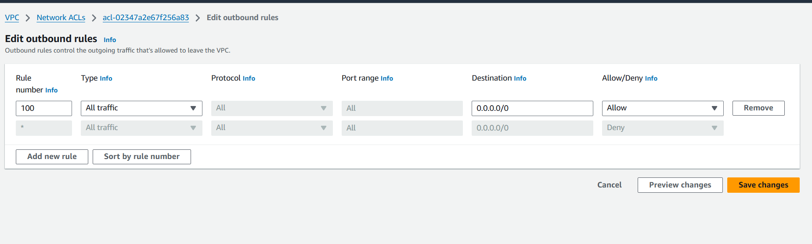

4. **Associate the NACL with the Public Subnet:**
   - Go to the "Subnet associations" tab.
   - Click "Edit subnet associations."
   - Select your public subnet and click "Save."
   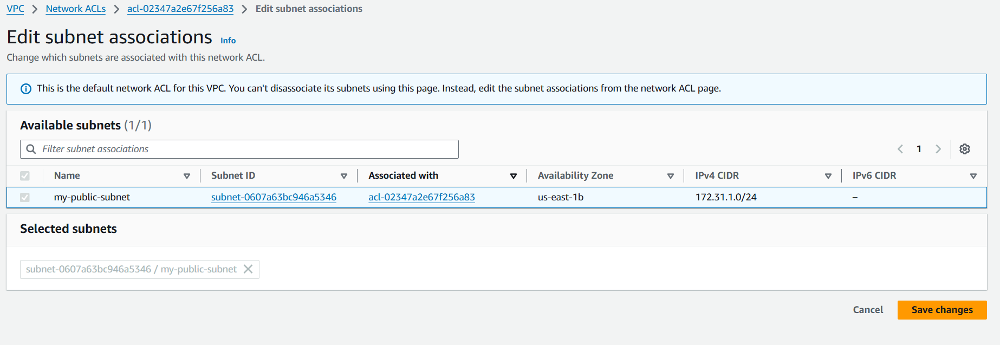

Step 6: Launch an EC2 Instance

1. **Navigate to the EC2 Dashboard:**
   - Click on "Launch Instance."
   - Choose an Amazon Machine Image (AMI), such as **Amazon Linux 2**.
   - Select an instance type (e.g., `t2.micro`).
   - In the "Configure Instance" step, ensure you select your VPC and the public subnet.
   - Configure storage and security group (allow inbound traffic on HTTP and SSH).
   - Review and launch the instance.

2. **Get the Public IP Address:**
   - After launching, note the public IP address of the instance.

Step 7: Set Up a Simple Web Application

1. **SSH into Your EC2 Instance:**
   ```bash
   ssh -i your-key.pem ec2-user@your-instance-public-ip
   ```

2. **Install a Simple Web Server:**
   ```bash
   sudo yum update -y
   sudo yum install -y httpd
   ```

3. **Start the Web Server:**
   ```bash
   sudo systemctl start httpd
   sudo systemctl enable httpd
   ```

4. **Create a Simple HTML Page:**
   ```bash
   echo "<html><h1>Welcome to My VPC Web App!</h1></html>" | sudo tee /var/www/html/index.html
   ```

5. **Access Your Application:**
   - Open a web browser and navigate to `http://your-instance-public-ip`. You should see the welcome page.
   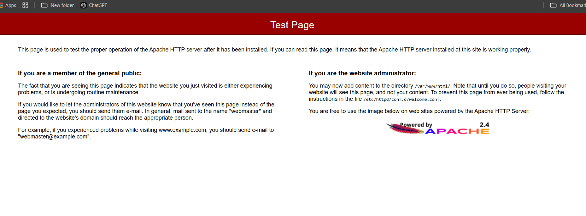

Conclusion

You've successfully created a real-time web application within a VPC, utilizing subnets, route tables, an Internet Gateway, and Network ACLs. This setup provides a solid understanding of AWS networking components and how they work together.
